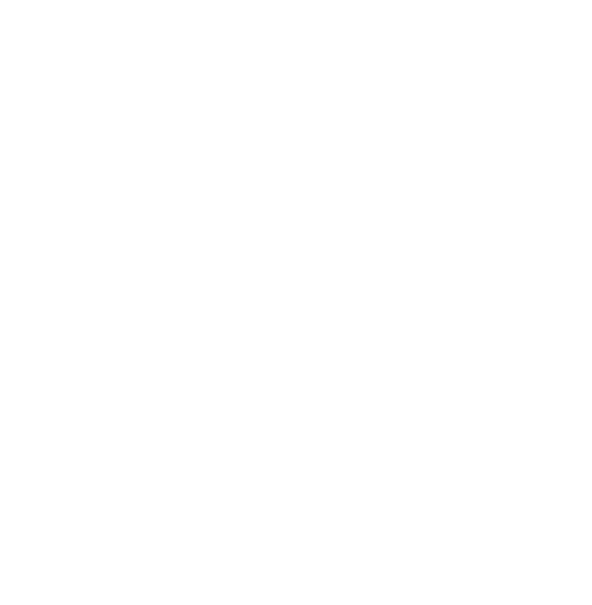
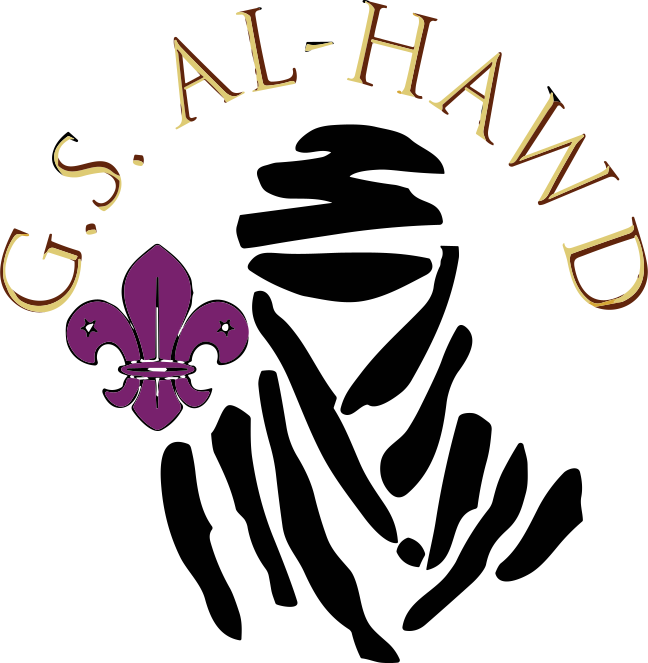
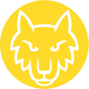
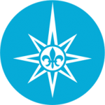
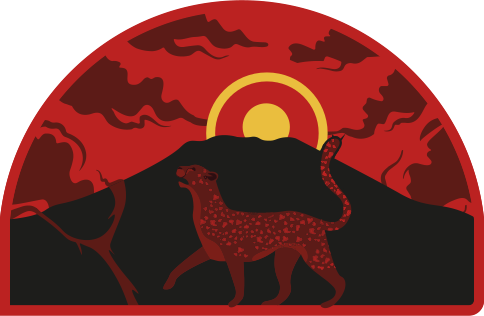

Nuestras Ramas - Grupo Scout Al-Hawd

[ Volver](../) [Castores](#castores) [Lobatos](#lobatos) [Rangers](#rangers) [Rutas](#rutas) [Kraal](#kraal)

<a href="../" id="hhm-inicio">Inicio</a> <a href="../about/" id="hhm-el-grupo">El Grupo</a> <a href="#" id="hhm-nuestras-ramas">Nuestras Ramas</a> <a href="../blog/" id="hhm-blog">Blog</a> <a href="../contact/" id="hhm-contacto">Contacto</a>

<a href="tel:" id="hhbn-phone" target="_blank"><em></em></a> <a href="" id="hhbn-instagram" target="_blank"><em></em></a> <a href="" id="hhbn-facebook" target="_blank"><em></em></a>

# Nuestras Ramas

# 

## Castores

# 

## Lobatos

# 

## Rangers

 

# 

## Rutas - Agrupación Cabo de Venus

<a href="https://nyerii.github.io/" target="_blank"><em></em> Saber más...</a>

# Kraal

## Responsables

<a href="tel:" id="fnm-phone" target="_blank"><em></em></a> <a href="" id="fnm-instagram" target="_blank"><em></em></a> <a href="" id="fnm-facebook" target="_blank"><em></em></a>

<a href="../" id="hhm-inicio">Inicio</a> <a href="../about" id="hhm-el-grupo">El Grupo</a> <a href="#" id="hhm-nuestras-ramas">Nuestras Ramas</a> <a href="../blog/" id="hhm-contacto">Blog</a> <a href="../contact" id="hhm-contacto">Contacto</a>
